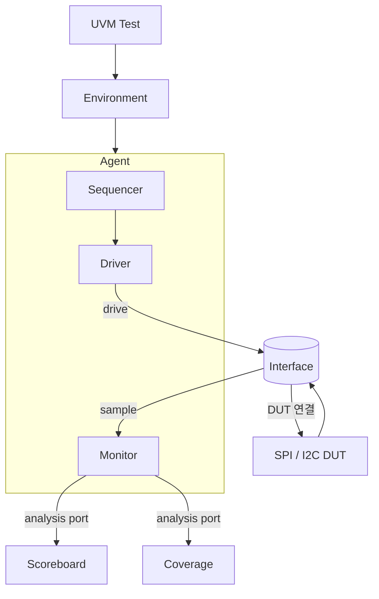
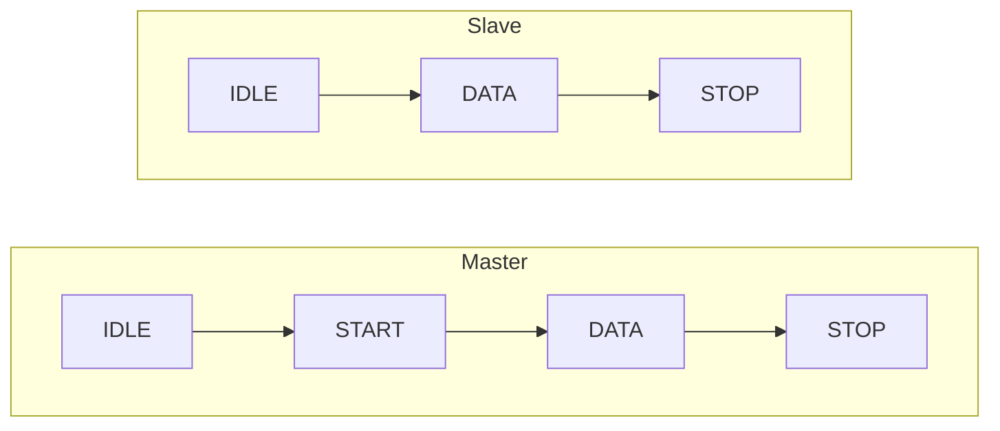
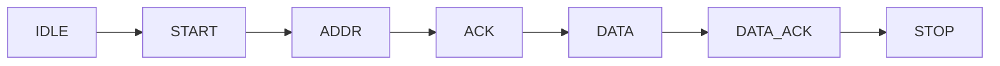

# SPI·I2C Protocol UVM Verification

> **SystemVerilog/UVM 기반 SPI·I2C 프로토콜 검증 환경 구축** — 제약 랜덤 + 기능 커버리지로 검증 자동화


AXI 기반 SPI·I2C 커스텀 주변장치를 대상으로, **재사용 가능한 UVM 검증 환경**을 SystemVerilog로 구축했습니다.
프로토콜 FSM을 분석해 검증 시나리오를 설계하고, **제약 기반 랜덤 자극**과 **기능 커버리지**로
SPI·I2C 각 **10,000 트랜잭션 전수 PASS · 커버리지 100%**의 self-checking 검증 자동화를 달성했습니다.

---

## Highlights

- **재사용 가능한 UVM 환경** — `test → env → agent → scoreboard·coverage` 표준 계층 구조
- **self-checking 검증** — monitor 트랜잭션을 analysis port로 전달, Scoreboard가 자동 비교
- **제약 기반 랜덤** — 대표값 + 랜덤 제약으로 시나리오 자동 생성
- **기능 커버리지 100%** — covergroup 기반 검증 완결성 확보
- **검증 자동화 성과** — SPI·I2C 각 **10,000 트랜잭션 전수 PASS**

---

## UVM Environment Architecture



> Monitor가 관측한 트랜잭션을 analysis port로 Scoreboard·Coverage에 전달하는 **self-checking** 구조

---

## Protocol FSM Analysis

**SPI** — Master–Slave 1:N 동기식 직렬, **Full-duplex** (고속·단순하나 핀 수 많고 ACK 없음)



**I2C** — 2-wire Open-drain(풀업 저항), 매 바이트 **ACK/NACK** (저핀·저가이나 Half-duplex·저속)



---

## FSM Simulation

| 프로토콜 | 검증 패턴 | 확인 내용 |
|----------|-----------|-----------|
| **SPI** | `0x55` · `0xAA` | SCK에 맞춘 MOSI·MISO 비트 시프트·샘플링을 파형으로 대조 |
| **I2C** | 주소 `0x12` · R/W | START·ADDR·ACK·DATA 프레임과 매 바이트 ACK/NACK 동작 검증 |

---

## Verification Strategy

**① 제약 기반 랜덤 시나리오**
`seq_item`에 대표값(`0x00`·`0xFF`·`0xAA`·`0x55`, I2C 주소 `0x12`)과 랜덤 제약을 정의하고,
sequencer가 `start_item → randomize → finish_item`을 `num_trans`만큼 반복하여 자극을 인가.

**② Scoreboard (self-checking)**
`m_rx == s_tx`, `s_rx == m_tx` 비교로 송수신 정합성을 자동 검사, 불일치 시 `uvm_error` 발생.

**③ 기능 커버리지**
covergroup(`zero` · `alt` · `lsb/msb` · `low/mid/high`)으로 자극 분포를 측정 → **Coverage 100%** 달성.

---

## Results

| 항목 | 결과 |
|------|:----:|
| SPI 트랜잭션 | **10,000건 전수 PASS** |
| I2C 트랜잭션 | **10,000건 전수 PASS** |
| 기능 커버리지 | **100%** |
| 검증 방식 | self-checking 기반 **검증 자동화** |

---

## Troubleshooting

**SPI — synchronizer 클럭 지연에 의한 데이터 밀림**
> `clk_div`가 작을 때 synchronizer 클럭 지연으로 데이터가 밀리는 문제
> → `clk_div`를 **4 이상**으로 설정하여 해결

**I2C — randomize()에 의한 값 덮어쓰기 / START 타이밍**
> `m_ack_in` 할당 직후 `randomize()`가 값을 덮어쓰는 문제 → **할당 순서 수정**
> START가 비동기로 인가될 때 카운터 오버플로 → `bit_cnt` **비트폭 확장**

---

## Project Structure

```
spi-i2c-uvm-verification/
├── rtl/        # SPI · I2C DUT
├── tb/         # UVM 환경 (test · env · agent · sequencer · driver · monitor · scoreboard · coverage)
│   └── interface/   # DUT 연결 interface
├── sim/        # 시뮬레이션 스크립트, 커버리지 리포트
├── docs/       # FSM 분석, 발표 자료
└── README.md
```

---

## Tech Stack

`SystemVerilog` · `UVM` · `SPI / I2C Protocol` · `FSM Verification` · `Constrained Random` · `Functional Coverage` · `Scoreboard (self-checking)`

---

<div align="center">

**최은수** · [@eunsu1209](https://github.com/eunsu1209)

</div>
